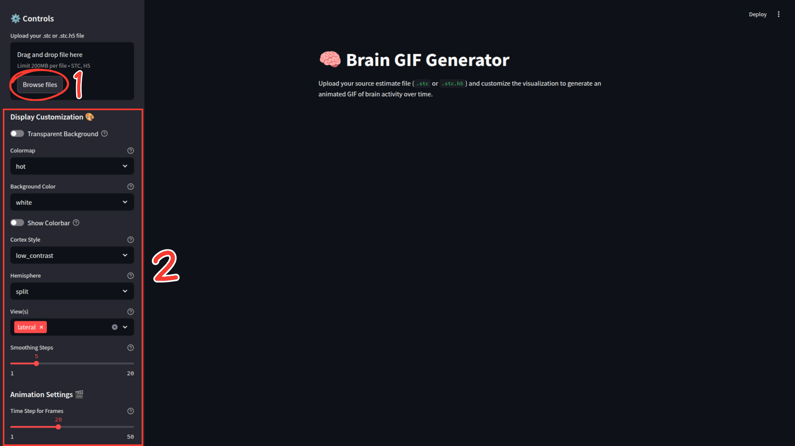
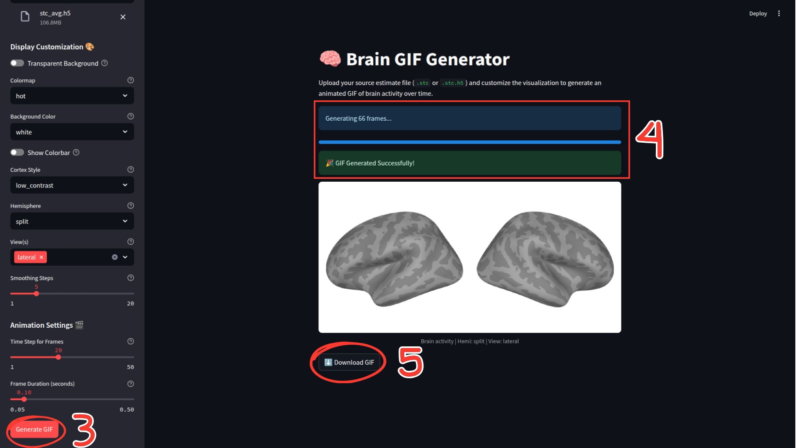

# 🧠 Brain GIF Generator

A **fast and user-friendly local web application** built with Streamlit and MNE-Python to generate high-quality, customizable animated GIFs of brain activity from MNE source estimate (`.stc`) files.

This tool is designed to be run on your own computer, giving you full control over your data and the generation process without needing to upload anything to the internet.

---

## ✨ Example Output

Below is an example of a GIF created with this application using the included sample data (`assets/stc_avg.h5`). You can generate similar high-quality visuals for your own research, presentations, and publications.


---

## 🧪 Test the App with Sample Data

This repository includes a sample MNE source estimate file, **`assets/stc_avg.h5`** (need to unzip it), so you can test the application immediately after installation without needing your own data.

Simply run the app, upload this file, and start experimenting with the controls!

## 🚀 Features

*   📂 **Local File Upload**: Works with `.stc` or `.stc.h5` files from your computer.
*   🖼️ **Transparent Background**: Toggle for a transparent background, ideal for overlays (work in progress!).
*   🎨 **Colormap Selection**: Choose from a wide range of colormaps (e.g., `hot`, `viridis`, `coolwarm`).
*   ⚫️ **Background Color**: Set the background to `white` or `black`.
*   🌈 **Colorbar Toggle**: Show or hide the colorbar.
*   🧠 **Cortex Style**: Select from different cortex rendering styles (`low_contrast`, `classic`, `high_contrast`).
*   ↔️ **Hemisphere Views**: Visualize the left (`lh`), right (`rh`), or both hemispheres in a `split` view.
*   👀 **Multiple Camera Angles**: Select and combine multiple views (`lateral`, `medial`, `rostral`, etc.).
*   〰️ **Data Smoothing**: Apply smoothing to the surface data for a cleaner look.
*   🎬 **Animation Control**: Adjust the frame step and duration to fine-tune your GIF.
*   ✅ **Instant Preview**: The generated GIF is displayed directly in the app.
*   ⬇️ **Direct Download**: Download your generated GIF with a single click.

## 📦 Local Installation & Setup

Follow these steps to get the Brain GIF Generator running on your local machine.

#### **1. Prerequisites**
*   **Python 3.8+**
*   An environment management tool like `venv` or `conda` is highly recommended.

#### **2. Installation & Running the App**

Open your terminal or command prompt and run the following commands:

```bash
# 1. Clone the repository (or download the code)
git clone https://github.com/jubnr/brain-gif-generator.git
cd brain-gif-generator

# 2. Create and activate a virtual environment (recommended)
python -m venv venv # optional

# 3. Install the required packages
pip install -r requirements.txt

# 4. Run the Streamlit app
streamlit run app.py
```
After running the last command, your default web browser should automatically open a new tab with the running application.

## ⚙️ How to Use the App Interface

Once the app is running in your browser, the process is simple:

1.  **Upload File**: In the sidebar, click "Browse files" and select an `.stc` or `.stc.h5` file. (You can use the `stc_avg.h5` file included in this repository to test the app immediately but before it will be needed to: `unzip stc_avg.zip`).
2.  **Customize**: Adjust the settings in the "Display Customization" and "Animation Settings" sections to your preference.
3.  **Generate**: Click the primary "Generate GIF" button. The app will show progress indicators while it works.
4.  **Preview & Download**: Once complete, your GIF will appear on the main page. Use the "Download GIF" button to save it.

## 💡 How It Works
The application follows a simple pipeline:

1.  **Upload & Configure**: The user uploads an `.stc` file and selects visualization parameters from the sidebar.
2.  **MNE Visualization**: MNE-Python's 3D plotting backend (`pyvista`) is used to create a `Brain` object on the `fsaverage` template. The MNE `fsaverage` dataset is automatically downloaded and cached on first run.

3.  **Frame Generation**: The app iterates through the specified time points of the source estimate, saving a high-resolution PNG screenshot for each frame into a temporary directory.
4.  **GIF Assembly**: The `imageio` library compiles the individual PNG frames into a single, optimized, looping GIF, and will correctly handling transparency (work still in progress!).
5.  **Display & Download**: The final GIF is presented to the user for preview and download.



## 🤝 Contributing & Future Ideas

Contributions are welcome! Feel free to open an issue and/or submit a pull request.

Some potential ideas for future development:
*   Allowing users to select a custom time range for the animation.
*   Adding more advanced `mne.viz.Brain` parameters as options.
*   Support for other template brains besides `fsaverage` (e.g. brain anatomy of a specific subject).

---